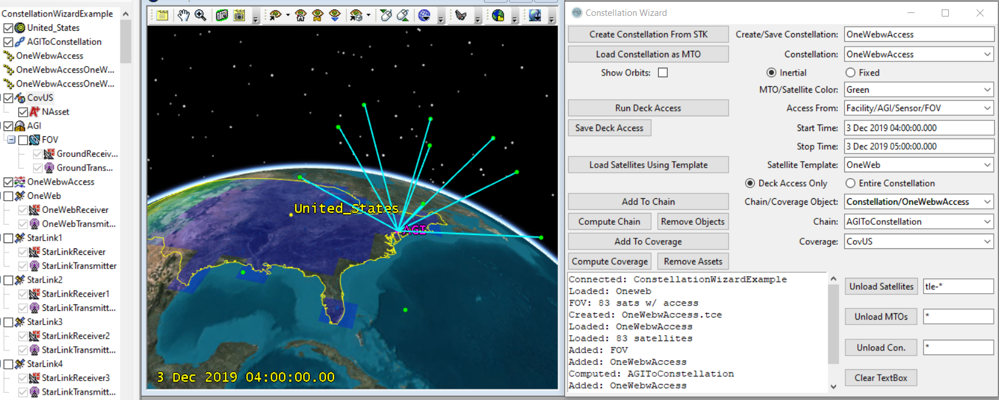
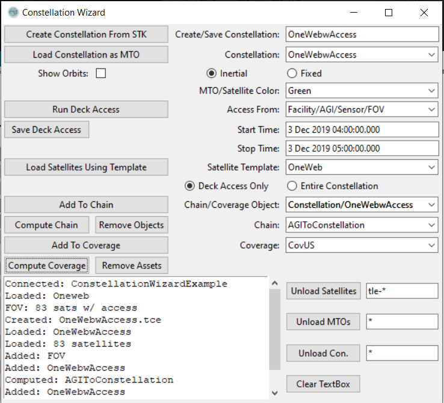

# Constellation Wizard

Python code and a user inteface to allow subsets of large satellite constellations to quickly be built and loaded into STK, perform analysis, and then unloaded. In this way analysis at different times or with different constellations can be performed without loading in thousands of satellites.

## Requirements and File Overview

* Need Python 3.6 or 3.7 installed along with standard Python libraries. An Anaconda3 installation will work.
* Need to have the comtypes.gen folder created, which requires STK to have been started from Python before. If you have trouble connect please see this [FAQ](https://agiweb.secure.force.com/faqs/articles/Keyword/Having-Trouble-Connecting-to-STK-with-Python)
* Download and unzip the attached zip folder, which contains:

  * [ConstellationWizardUI.ipynb](ConstellationWizardUI.ipynb): When the code is executed a user interface will appear, which will try to attach to an open instance of STK. The user interface contains buttons to create a constellation.tce file, load the constellation.tce file visually into STK as a MTO, performing deck access to limit the number of satellites, loading these satellites into STK, setting up chains and coverage analysis using these newly added satellites along with any children objects they bring along based on a satellite template, and finally unloading the objects. The UI format makes interacting with large satellite constellations inside STK much easier.
  * [ConstellationWizardNotebook.ipynb](ConstellationWizardNotebook.ipynb): Similar functionality as the ConstellationWizardUI, but goes into more detail on editing constellations and saving analysis results. The notebook format allows more flexibility, customization and automation for custom use cases.
  * [ConstellationWizardTradeStudy.py](ConstellationWizardTradeStudy.py): An example of automating analyses across multiple constellations and over multiple time periods. Chain, Coverage and Comm interference results are saved at each iteration.
  * [CreateConstellationsUtilities.ipynb](CreateConstellationsUtilities.ipynb): The notebook shows how to pull existing constellations from Celestrak, build notional constellations from planes of satellites using parameters saved in an excel file, merge multiple planes into a larger constellation and update the dates of the constellation.tce files. An example excel sheet is included.
  * Files subfolder: This is where all of the constellation.tce files, children objects, deck access reports, etc. are saved.
  * [DeckAccessReader.py](DeckAccessReader.py) and [DeckAccessReaderGUI](DeckAccessReaderGUI.py): Contain a list of helper functions to help the other notebooks.

## Running the Example

Open a STK scenario and then run one of the desired Jupyter Notebooks.

 
### Constellation Wizard UI

* Run the ConstellationWizardUI.ipynb and an app should appear (if you don't see it, click the icon (User-added image) in the task bar and it should come to the front)
* It will try to connect to an open instance of STK, otherwise it will launch STK and open a new scenario.
* Create Constellation From STK: Creates a constellation.tce file from all of the current satellites in the scenario. Uses the file name in the Create/Save Constellation field.
* Load Constellation as MTO: Loads an existing constellation from the Constellation field as an MTO from visualization inside STK. Uses the MTO/Satellite Color field. It also uses the options to show orbits and in which orbit frame.
* Run Deck Access: Computes deck access using the Access From field and the constellation in the Constellation field, over the interval between the Start Time and the Stop Time fields. If you would like to use a constraint template for access to the satellites, select a satellite in the Satellite Template field. This button will create a deckAccessRpt.txt and a deckAccessTLE.tce file.
* Save Deck Access: Saves a constellation.tce file using the Create/Save Constellation field.
* Load Satellites Using Template: Inserts satellites into STK and bringing along any children associated with the Satellite Template (this does not copy the Satellite Template, it only bring along the children objects). If the Deck Access Only radio button is selected, the most recently run deckAccessTLE.tce file will be used. If entire constellation is selected, then all of the satellites in the constellation.tce file will be loaded. This also groups all of the inserted satellites and their children objects into constellations.
* Add To Chain: Adds the object from the Chain/Coverage Object field to the chain selected in the Chain field.
* Compute Chain: Computes the chain selected in the Chain field. Any reports or saving is left to the user.
* Remove Objects: Unload all objects of the chain selected in the Chain field.
* Add To Coverage: Adds the object from the Chain/Coverage Object field to the coverage definition selected in the Coverage field.
* Compute Coverage: Computes the coverage selected in the Coverage field. Any reports or saving is left to the user.
* Remove Assets: Unload all objects of the coverage selected in the Coverage field.
* Unload Satellites: Unloads all satellites in the scenario which match the specified naming pattern. The * symbol is a wildcard character which will match any other unknown characters.
* Unload MTOs: Unloads all MTOs in the scenario which match the specified naming pattern
* Unload Con.: Unloads all constellations in the scenario which match the specified naming pattern
* Clear TextBox: Clears the textbox.

### Constellation Wizard Notebook

* Similar functionality to the ConstellationWizardUI but in a Jupyter Notebook format and it covers a few more details:
  * Pulling the TLE and deck access data back into Python
  * Addtional filtering on which satellite to load by orbital elements and deck access
  * Automatically running chain and coverage analyses
  * Saving data from the analyses and loading them back into Python

### Constellation Trade Study

* A python script, which is provides an example of how to automate chain, coverage and comm interference analysis. The specific analyses will likely need to be modified for your exact use case, but the script can serve as a good starting point. The script loops through multiple constellations and multiple analysis intervals.

### Create Constellation Utilities

* A Jupyter Notebook, which is useful for pulling existing constellations, creating many constellation.tce files, merging multiple constellation files into one and updating the dates on the constellation.tce files.
