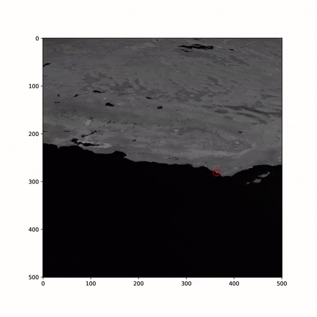

# EOIRTrackingInTheLoop

  * EOIRTrackingInTheLoop.ipynb - The code to automate STK, take EOIR images, process the images, generate measurements, update point directions and optionally run ODTK in the loop
  * ExampleBuildingReflectanceMaps.ipynb - Helps convert images into reflectance,emmissivity and temperature maps to be used in EOIR
  * EOIRProcessingLib.py - Helper functions for the EOIRTrackingInTheLoop notebook, includes image processing, pulling data providers 

