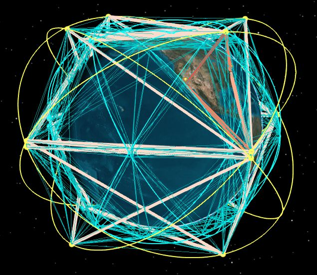
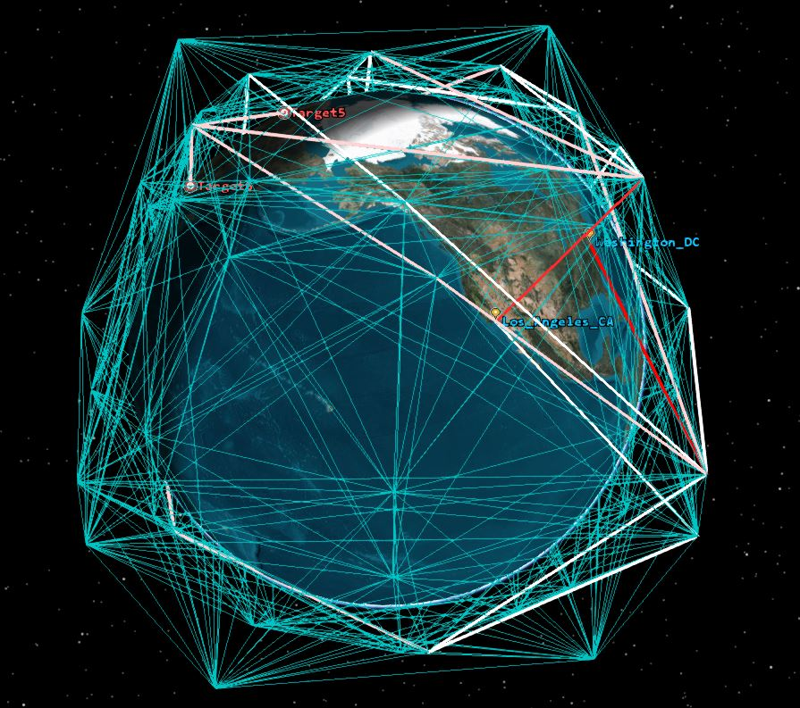
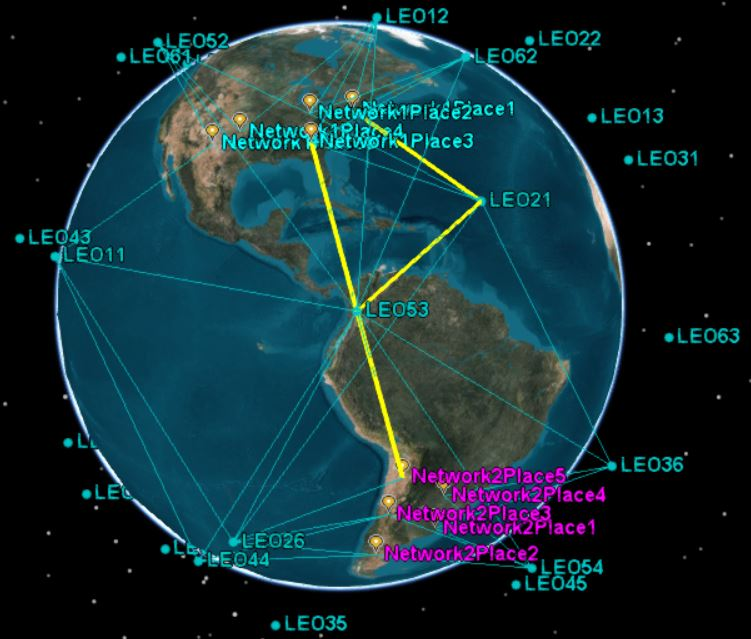
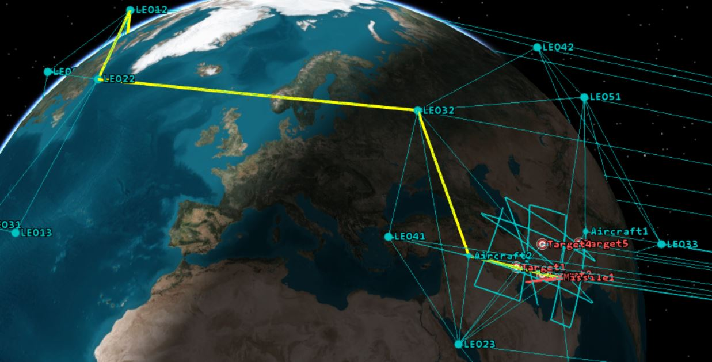
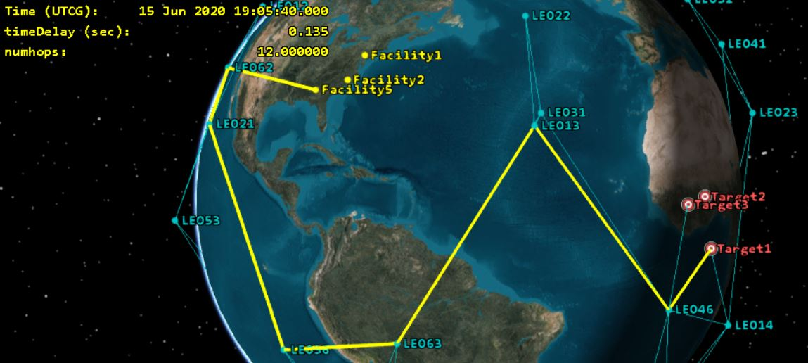

# Constellation and Network Routing

All of the notebooks attach to an open instance of STK.
The associated example scenarios can be found on our [**Constellation and Network Routing Example.**](https://sdf.agi.com/share/page/site/agi-support/document-details?nodeRef=workspace://SpacesStore/674cb49a-f67e-40f5-b7c5-0fd57abbb879)

**Terminology**
* Node = Object in STK: Satellites, Aircraft, Facilities, Sensors, Transmitters, etc.
* Edge = Access between two objects in STK, includes typical STK constraints
* Strand = The sequence of nodes and edges to complete access in a chain or between a starting and ending constellation. Path and Route are also sometimes used
 
**Types of Analysis Shown**
* Pulling intervals of access for nodes, edges and strands in a network into Python
* Summary statistics on network utilization and performance
* Find the "best" route through a network (fewest handoffs, shortest distance, least time latency)
* Supports multihop paths betweens constellations
* Identify important nodes in a network at an instant and over time
* See the impacts on network connectivity when nodes are removed
* Load data back into STK for visualization and for reports/graphs

## DataTransfer.ipynb 
This is the most up-to-date notebook, focused on transfering data through a notebook based on bandwidth. It is recommended you take a look at the other notebooks to figureout other types of analysis you can do. Use this notebook and MultiConstellationMultiHop.ipynb for most problems. 

## MultiConstellationMultiHop.ipynb

This is the 2nd most up-to-date and capable notebook using chainPathLib2. Computes the "best" multihop path between a starting and ending nodes. Supports a series of hops between multiple constellations, finding the top N best pathways and merging results into one network. The constellation order concept is similar to a chain but multiple hops between each constellation are permitted. Shows an example with satellites, sensors, transitters and recievers. 

## Older notebooks examples using the chainPathLib

## ConstellationAnalysisUsingPrebuiltChains.ipynb

Walks through types of analysis described above using prebuilt chains in STK 

## ConstellationAnalysisMultiDomainAndMultiHop.ipynb

Computes the "best" multihop path between a starting and ending constellations, utilizing different types of STK Objects. Investigates how the optimal path changes when nodes are removed 

## ConstellationAnalysisTransRec.ipynb
Computes the "best" multihop path between a starting and ending constellations through a satellite constellation with transmitters and receivers. Investigates the effects of changing transmitter power and signal strength constraints 

