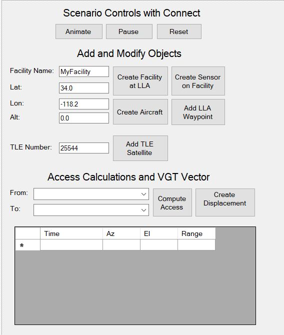
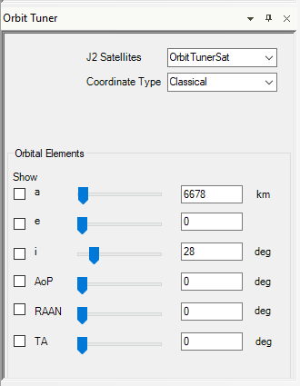

# STK UiPlugins (C#)

STK UiPlugins using C#.

For general installation direction please refer to:

* [registration free](https://help.agi.com/stkdevkit/index.htm#STKPlugins/NETuiPlugins_Registration.htm)
* [registered](https://help.agi.com/stkdevkit/index.htm#STKPlugins/uiPlugins_Registration.htm)

---

## [Articulations](Articulations)

This plugin is designed to work with all model types including MDL, Collada, and glTF. To successfully use the plugin, you need a model that has built-in articulations. A good starting point is to use the default models that come with the STK install. For setup, simply download the attached zip folder and follow the instructions listed below.

For more information on the plugin and install instructions please refer to [this FAQ](https://agiweb.secure.force.com/code/articles/Custom_Solution/Articulation-Creator-Plugin).

---

## [CameraControlAutomator](CameraControlAutomator)

The Camera Control Automator is a tool that allows you to easily generate custom camera paths without having to click through every frame.

For install instructions and more information please refer to [the pdf writeup](CameraControlAutomator/Camera%20Control%20Automator%20Documentation.pdf)

---

## [ConstrainedAttitude](ConstrainedAttitude)

This plugin allows you to implement angle limit constraints on your vehicle's attitude. Select a vector to align a body axis with, then constrain another body axis to a specified constraint vector. Finally, specify an angle offset limit from the constraint vector.

After creating the attitude, the vehicle will remain aligned with the alignment vector until reaching the angle offset limit. Once at the limit, the attitude will hold there while still attempting to stay with the alignment vector. Once the angle offset is below the limit, the attitude returns to normal.

To use this plugin directly, follow the instructions [here](https://agiweb.secure.force.com/code/articles/Custom_Solution/Constrained-Attitude-UI-Plugin)

---

## [CustomFrameEphemeris](CustomFrameEphemeris)

This plugin makes possible to export an ephemeris for certain objects in any frame that exists in Analysis Workbench into your current scenario.

For more information and install instructions please refer to [this FAQ](https://agiweb.secure.force.com/faqs/articles/HowTo/How-do-I-export-an-STK-ephemeris-e-in-a-custom-coordinate-frame)

---

## [DataImporter](DataImporter)

This plugin is a generalized data importer for STK that allows you to generate or update an STK Object.

---

## [FromGfxUpdater](FromGfxUpdater)

This plugin allows the user to right click on a Figure of Merit and then:

* generate a grid stats over time report
* update the static graphics with a color ramp that goes from min/max (blue/red)
* update the dynamic graphics with a color ramp that goes from min/max (blue/red)

---

## [GroundVehicleFromDirections](GroundVehicleFromDirections)

This plugin utilized the Bing Maps API to create an STK ground vehicle.  The plugin allows for 3 different options to generate these ground vehciles.

1) Enter an origin and destination address and it will route a GroundVehicle along this path
2) Enter an origin and destination address and it will route a GroundVehicle along this path
3) Select a lat/lon box and the number of GroundVehicles and it will generate paths from random start/stop locations within the box to simulate traffic

---

## [ModelPixelUpdater](ModelPixelUpdater)

This plugin allows you to define a "scale factor" for a model to use that will then update constantly as you zoom in and out.

---

## [MoveMtoTime](MoveMtoTime)

This UI Plugin shifts selected MTOs or specific tracks by the specified amount of time. The source code can be found in the VisualStudio folder. This plugin will only work in STK 12.

To use the plugin right click on an MTO in your STK scenario, hover over MTO Plugins and select Move MTO Time.

To install the plugin, move the entire contents of the RegFreePluginFiles folder to C:\Program Data\AGI\STK 12\Plugins. Open the MoveMtoTime folder, right click on the Agi.UiPlugin.MoveMtoTime.dll file and open its properties. If you see a "Security" section at the bottom, check the "Unblock" box and click OK. Do the same for the PDB file.

---

## [ObjectModelTutorial](ObjectModelTutorial)

This closely follows the [Object Model Tutorial](https://help.agi.com/stkdevkit/index.htm#stkObjects/ObjectModelTutorial.html) in C# and builds a simple UI to automate simple tasks such as:

* Inserting objects
* Adding constraints
* Computing access
* Areating vectors
* Displaying data

---

## [OperatorsToolbox](OperatorsToolbox)

Operator’s Toolbox is a UI plugin designed specifically to improve the efficiency of common operational tasks. The tools made available in this plugin are mainly based on customer requests to automate certain processes within STK in an effort to reduce analysis time for real world scenarios.

For more information about the plugin and individual tools please refer to the specific [README](OperatorsToolBox/README.md) and [pdf walkthrough](OperatorsToolBox/Operator's%20Toolbox%20Documentation%20V1.2.pdf)

---

## [OrbitTuner](OrbitTuner)

The Orbit Tuner UI plugin allows you to use slider bars to change the value of the orbital elements and have the orbit updated in real-time in the 3D Graphics Window. you can also type in values to change the orbit.

---

## [PlanetsToggle](PlanetsToggle)

This plugin allows you to quickly add planets and change your planetary view.  When budilding the plugin there is an installer project included.

---

## [SensorBoresightView](SensorBoresightView)

For install instructions please refer to the proper readme coorelating to your STK version.

* [STK 10](SensorBoresightView/Stk10.SensorBoresightView/Readme.txt)
* [STK 11](SensorBoresightView/Stk11.SensorBoresightView/Readme.txt)
* [STK 12](SensorBoresightView/Stk12.SensorBoresightView/Readme.txt)

---

## [SimGEN_UMTExporter](SimGEN_UMTExporter)

This UiPlugin adds an 'Export UMT File' option to STK vehicles.  This will then generate an UMT (user motion) file for use in SimGEN.

For install instructions and further information please refer to the [readme](SimGEN_UMTExporter/README.docx)

---

## [HorizonsEphemImporter](Stk12.UiPlugin.HorizonsEphemImporter)

This UiPlugin allows you to import objects from the JPL Horizons database into STK. This plugin is compatible with STK 12.

---
